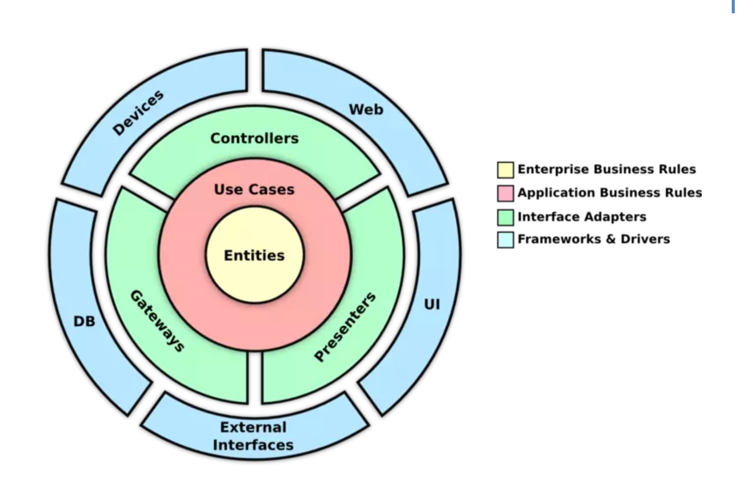

# Tóm tắt Clean Architecture và Tổ chức Dự án Java Spring

## 1. Tóm tắt Clean Architecture

- **Khái niệm**:
    - Clean Architecture là mô hình kiến trúc phần mềm do Robert C. Martin đề xuất.
    - Mục tiêu: Tạo hệ thống dễ bảo trì, dễ kiểm thử, độc lập với framework, cơ sở dữ liệu, và giao diện người dùng.
- **Nguyên tắc chính**:
    - **Dependency Rule**: Các tầng bên trong không phụ thuộc vào tầng bên ngoài; phụ thuộc chỉ hướng từ ngoài vào trong qua các interface.
    - **Tách biệt trách nhiệm**: Mỗi tầng có vai trò rõ ràng, đảm bảo logic kinh doanh không bị ảnh hưởng bởi chi tiết triển khai.
    - **Dễ kiểm thử**: Logic kinh doanh (Entities, Use Cases) có thể test độc lập mà không cần framework.
- **Các tầng chính**:
    1. **Entities (tầng Domain)**:
        - Chứa đối tượng kinh doanh cốt lõi (Enterprise Business Rules).
        - Ví dụ: Lớp `User` với logic validate email.
    2. **Use Cases (tầng Application)**:
        - Chứa logic kinh doanh cụ thể của ứng dụng (Application Business Rules).
        - Ví dụ: `CreateUserUseCase` để xử lý quy trình tạo người dùng.
    3. **Interface Adapters**:
        - Chuyển đổi dữ liệu giữa tầng bên trong và bên ngoài.
        - Bao gồm: Controllers, DTOs, Presenters.
    4. **Frameworks & Drivers**:
        - Chứa chi tiết triển khai như cơ sở dữ liệu (JPA, MongoDB), web server (Spring Boot).
- **Lợi ích**:
    - Độc lập với framework, dễ thay đổi công nghệ.
    - Dễ viết unit test cho Use Cases và Entities.
    - Tăng khả năng bảo trì và mở rộng.
- **Nhược điểm**:
    - Có thể phức tạp cho dự án nhỏ do nhiều boilerplate code.

## 2. Tổ chức Dự án Java Spring theo Clean Architecture

- **Dự án mẫu**: User Management (quản lý người dùng) với các tính năng CRUD.
- **Cấu trúc thư mục**:

### Giải thích các tầng

1. **Tầng `domain`**:
- **Mục đích**:
    - Chứa logic kinh doanh cốt lõi (Enterprise Business Rules).
    - Bao gồm Entities và Repository Interface.
- **Thành phần**:
    - `entity/User.java`: Đối tượng `User` với thuộc tính (id, name, email) và logic (validate email).
    - `repository/UserRepository.java`: Interface định nghĩa phương thức truy cập dữ liệu (`save`, `findById`).
- **Lý do**:
    - Repository Interface là abstraction, thuộc logic kinh doanh cốt lõi.
    - Đảm bảo `domain` độc lập, dễ kiểm thử, tuân thủ Dependency Rule.

2. **Tầng `application`**:
- **Mục đích**:
    - Chứa Use Cases, định nghĩa logic kinh doanh cụ thể của ứng dụng.
- **Thành phần**:
    - `usecase/CreateUserUseCase.java`: Xử lý quy trình tạo người dùng.
    - `usecase/GetUserUseCase.java`: Lấy thông tin người dùng theo ID.
- **Lý do**:
    - Use Cases thuộc Application Business Rules, phối hợp Entities và Repository Interface.
    - Không phụ thuộc vào framework, đảm bảo tính độc lập.

3. **Tầng `adapter`**:
- **Mục đích**:
    - Chuyển đổi dữ liệu giữa tầng bên trong (`application`, `domain`) và bên ngoài (HTTP, client).
- **Thành phần**:
    - `controller/UserController.java`: Xử lý HTTP request/response, gọi Use Cases.
    - `dto/UserRequestDto.java`, `dto/UserResponseDto.java`: DTOs truyền dữ liệu API.
    - `mapper/UserMapper.java`: Chuyển đổi DTO-Entity (dùng MapStruct).
- **Lý do**:
    - DTO và Controller thuộc Interface Adapters, xử lý giao tiếp với thế giới bên ngoài.

4. **Tầng `infrastructure`**:
- **Mục đích**:
    - Chứa chi tiết triển khai như cơ sở dữ liệu, framework, cấu hình.
- **Thành phần**:
    - `persistence/JpaUserRepository.java`: Triển khai `UserRepository` với JPA.
    - `persistence/UserJpaRepository.java`: Interface Spring Data JPA.
    - `config/ApplicationConfig.java`: Cấu hình Spring beans.
- **Lý do**:
    - Xử lý phụ thuộc framework, giữ các tầng bên trong độc lập.

### Lưu ý khi tổ chức
- **Dependency Injection**:
- Sử dụng Spring để inject dependency (như `UserRepository` vào `CreateUserUseCase`).
- **Validation**:
- Thêm `@NotBlank`, `@Email` vào DTO để kiểm tra dữ liệu đầu vào.
- **Mapper**:
- Dùng MapStruct để chuyển đổi DTO-Entity, giảm boilerplate.
- **Unit Testing**:
- Viết test cho Use Cases, mock `UserRepository` để kiểm tra logic.
- **Dự án nhỏ**:
- Có thể gộp `domain` và `application` nếu không cần tách biệt rõ ràng.

## 3. Lợi ích của Cấu trúc
- **Độc lập**:
- Thay đổi cơ sở dữ liệu (JPA sang MongoDB) chỉ cần chỉnh `infrastructure`.
- **Dễ kiểm thử**:
- Use Cases và Entities test được mà không cần DB/framework.
- **Bảo trì**:
- Cấu trúc rõ ràng, dễ mở rộng cho dự án lớn.